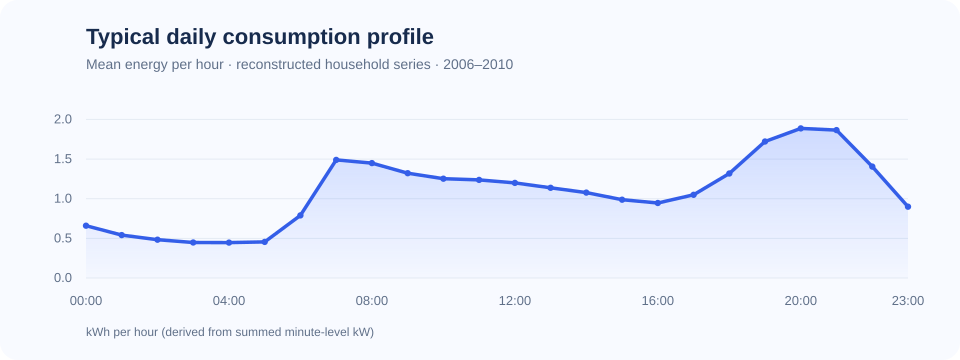

# Electricity Consumption Forecasting

Four cleaned forecasting experiments from an electricity consumption coursework project completed around 2022. The notebooks explore calendar features and observed lags with XGBoost, a one-step-ahead LSTM, and direct multi-month forecasting with Prophet. They were edited for readability and a sounder evaluation workflow while retaining the original approaches.



> **Reproducibility status:** The archive contained only four notebooks. Its missing hourly CSV was reconstructed from the [UCI Individual Household Electric Power Consumption dataset](https://archive.ics.uci.edu/dataset/235/individualhouseholdelectricpowerconsumption), also [mirrored on Kaggle](https://www.kaggle.com/datasets/uciml/electric-power-consumption-data-set). The reconstructed data matches the archived notebooks' first and last rows, row count, mean, standard deviation, minimum and maximum. Model results have not been re-executed, so no performance claims are included.

## Experiments

| Notebook | Question | Evaluation |
| --- | --- | --- |
| [01 · XGBoost](notebooks/01_xgboost.ipynb) | How much do calendar patterns and recent observations help? | Calendar-only full-horizon forecast; separate one-step-ahead lag experiment |
| [02 · LSTM](notebooks/02_lstm.ipynb) | Can a 24-hour sequence predict the next observed hour? | One-step-ahead with observed prior values |
| [03 · Prophet](notebooks/03_prophet.ipynb) | How does an additive seasonal model forecast the held-out period? | Direct forecast across the final 15% |
| [04 · Prophet tuning](notebooks/04_prophet_tuning.ipynb) | Do selected seasonality and trend settings improve validation error? | Parameter search on validation; final test once |

The lagged XGBoost and LSTM scores represent a different prediction task from the direct Prophet and calendar-only forecasts. They should not be ranked together as if they had the same information at prediction time.

## Data and setup

The notebooks read the included [hourly CSV](data/clean_hourly_data.csv): `ds` is the timestamp and `y` is the sum of minute-averaged active power readings (kW) within an hour. For complete hours, `y / 60` is energy in kWh. The source covers one household in Sceaux, France, from December 2006 to November 2010. The original readings are licensed [CC BY 4.0](https://creativecommons.org/licenses/by/4.0/) by Georges Hebrail and Alice Berard via UCI. See [data/README.md](data/README.md) for the citation and reconstruction method.

1. Create a Python environment and install `requirements.txt`.
2. Launch Jupyter Lab from this repository or its `notebooks` directory, then run notebooks in order as needed.

```bash
python -m venv .venv
# Activate .venv with your shell's standard command.
python -m pip install -r requirements.txt
python -m jupyter lab
```

The notebooks validate that timestamps are unique, sorted and exactly hourly, with no missing target values. They use a chronological 70/15/15 train/validation/test split. Validation is used for stopping or parameter selection; test is kept for final evaluation.

To regenerate the CSV, download the source ZIP from [UCI](https://archive.ics.uci.edu/dataset/235/individualhouseholdelectricpowerconsumption) and run `python scripts/prepare_data.py --archive path/to/download.zip`. The reconstruction forward-fills missing minute readings before hourly aggregation. This matches the archive's summary statistics but may distort periods with long missing stretches; see the data notes.

## What changed from the archive

- Removed empty cells, stale outputs, interrupted runs, temporary debugging, and broken references.
- Translated notes and code comments into English and renamed the notebooks consistently.
- Replaced obsolete `fbprophet` imports and deprecated pandas patterns.
- Corrected the LSTM scaling leak and separated model selection from final test evaluation.
- Removed the original US holiday calendar, which did not match the household's French location.

**Limitations:** The dataset reconstruction is strongly supported by the archived summary statistics, but the exact original preprocessing script was not available. Forward filling missing minute readings can bias the target. The notebooks have been structurally checked; full model runs remain to be verified. This repository is a curated coursework archive, not a production forecasting system.
